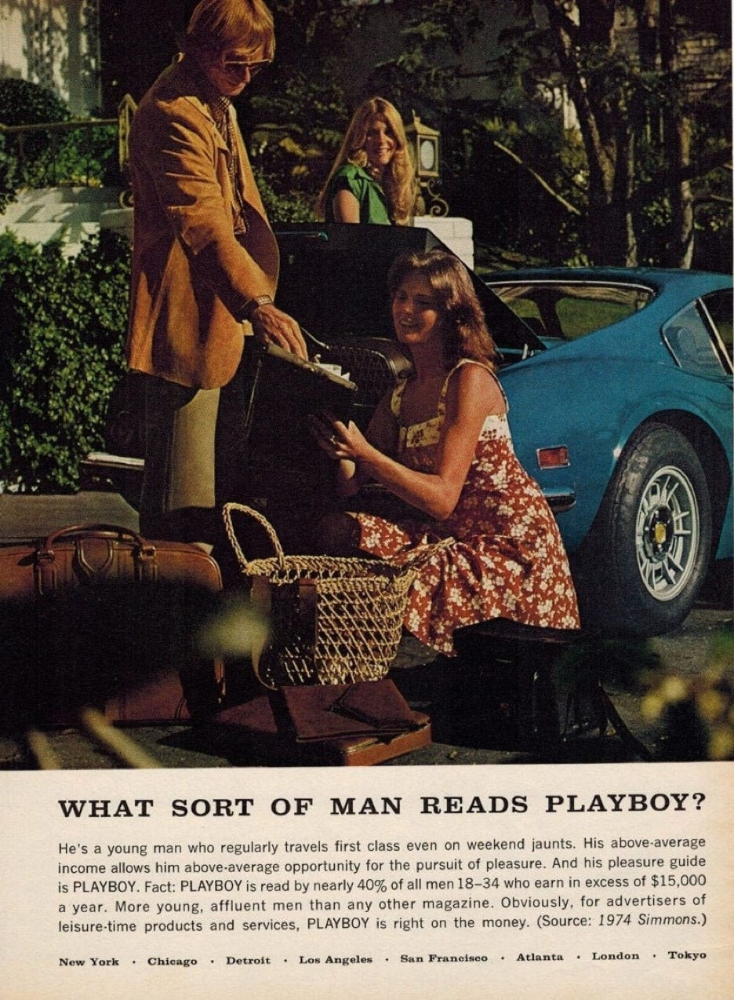

In the long out-of-print "The Making of a Counter-Culture," journalist Theodore Roszak argued that the 60’s-era left was greatly underestimating the ability of capitalism to co-opt their movement and sell it back to them. One example he cited was how Playboy had taken the sexual revolution and connected it to an upscale, sophisticated lifestyle. He was right then, and his insight still holds true today, extending far beyond Playboy.

When we look at the beliefs born from 60’s radical movements that have survived down to the current era, they are exclusively limited to the ones that were not only compatible with, but in many cases, an improvement on American capitalism. The oldest line in advertising, after “Patronized by Caesar," may be, "Sex Sells." In the end, disposing of the prohibition on using blatant sexual images and themes to sell everything from soap to _The Jerry Springer Show_, was a boon to corporations and that's why they framed that aspect of the counterculture in a positive way.

Similarly, racism and sexism have always been bad for capitalism. Commercial peoples have historically been more socially liberal than theocratic or feudal societies, because capitalism depends on large numbers buying, selling, trading, starting businesses, etc. Mo' people participating in the economy, mo' better for the generation of wealth.

And so the civil rights movement is allowed to continue in various forms today, with the core assumption that sexism and racism are bad, going unchallenged outside of truly fringe corners of the internet. Even a Tucker Carlson, who is often accused of dog-whistling on those issues, isn't really arguing for racism and sexism. What Carlson and others like him are arguing is that these things are no longer the problem the left is making them out to be. This point can be debated, but the idea that the conservative faction Carlson represents is arguing FOR sexism and racism, or challenging the idea that those things are wrong, is simply not true. In the end, Carlson is a capitalist. He has no interest in cutting off the spigot from which his frozen dinner wealth derives.

But there were many other ideological touchstones of the so-called New Left that have been scrubbed from the narrative. Much of their revolutionary effort was aimed at undermining capitalism, and far from being theoretical, some ingenious real-world efforts were made to displace "the money system." Labor exchanges were common on college campuses and in big cities; networks of people who would barter for goods and services. Both urban and rural experiments in communal living proliferated, and there was nary a leftist individual or organization that didn't identify as some shade of socialist, Marxist, or Maoist.

But unlike free love and civil rights, these ideas were not compatible with capitalism. And almost as soon as Hollywood began treating these subjects, a formula developed:

Act One: Naïve idealist hooks up with commune, or radical group.

Act Two: Idealist is gradually disillusioned by the reality of their lifestyle, and beliefs (the leader of the group will either be portrayed as a fool, sucking others into an unworkable scheme, or alternately, an abusive narcissist).

Act Three: Now Former Idealist returns to conventional society, sadder, but wiser. See: _Alice's Restaurant, Fritz the Cat, Where the Buffalo Roam, Across the Universe_; even Jenny's storyline in _Forrest Gump_ is lifted from the genre.



Today we can see this process playing out anew. The "revolutionary" movements of our era that are being embraced by the establishment and its mouthpieces in the corporate media, are the ones that can turn a profit. This is quite a bit easier for them than it was in the 60's and 70's, because to be anti-racist, anti-sexist and pro-LGBTQ is now an elite position that's been decoupled from any radical social or economic theory. It's a snap for the powerful to glom onto these causes, using them as both profit centers and cudgels against legitimate threats.

Want to smear a figure, or movement? Just accuse them of racism, sexism or homophobia, on any pretext. The pretext hardly matters in a world full of lonely, depressed, smart-phone addicted people, constantly on the lookout for the latest virtue-signaling opportunity. [That was what they did to Bernie Sanders](https://reason.com/2016/02/08/bill-clinton-accuses-bernie-bros-of-sexi/), and it's what they'll do to anyone like him who gets anywhere near the levers of power.

In this context, post-modernism and the academic disciplines that have arisen from it can be seen as the greatest boon to corporate profits and elite power ever to be conceived by the minds of humans. Anti-fact, anti-science, [premised on the idea that reality itself is a social construct](https://areomagazine.com/2017/03/27/how-french-intellectuals-ruined-the-west-postmodernism-and-its-impact-explained/) – people who have been taught to think this way are a marketing department's wet dream. Or a totalitarian government's.

And the best part is the way all these ideas can be sold as rebellious assaults on the citadels of power, thereby satisfying the need for activists to feel as if they're fighting for a cause and changing the world, when really, they're just making the population dumber and easier to manipulate.

A few examples:

When the majority are obese, telling fat folks (since all the libs are throwing around "folks" like they grew up on an alfalfa farm, I figured I'd appropriate it) they can look amazing at any size, is pretty appealing if you're trying to sell clothes or cosmetics to the greatest number of people. But you aren't sticking it to the beauty industry by promoting obesity as a lifestyle choice. You're just opening up a new market.

> The "nutritionist" they got for this video works for Mondelez International. They make oreos, chips ahoy, and sour patch kids. [https://t.co/9GcYGMKJY4](https://t.co/9GcYGMKJY4)
> 
> — 🇺🇸 🇺🇸 🇺🇸 Nezzy the Milk Roach 🇺🇸 🇺🇸 🇺🇸 (@PatientEyes6) [September 14, 2022](https://twitter.com/PatientEyes6/status/1569898242292465664?ref_src=twsrc%5Etfw)

If children experiencing gender dysphoria are allowed to let it play out, [studies show 60-90% will end up not trans, but gay](https://www.transgendertrend.com/wp-content/uploads/2017/10/Steensma-2013_desistance-rates.pdf). Not much money to be made in that, though. Now, making these kids dependent on a lifetime of hormone treatments, and possibly surgery – _that's_ where the big bucks are, or as Dr. Shane Taylor of the gender clinic at Vanderbilt University Hospital in Nashville [put it, in a now infamous video](https://www.eviemagazine.com/post/doctor-at-vanderbilt-university-transgender-clinic-admits-gender-transition-surgeries-big-money-maker), "There's entire clinics . . . supported just by their phalloplasty's, and that is like, a fraction of the surgeries they're doing. These surgeries are labor intensive . . . they require a lot of follow-ups . . . and they make money, they make money for the hospital."

And that's a big part of the reason why the medical establishment is working overtime to normalize the idea of applying extreme, irreversible, and life-altering medical intervention to a group that no one would seriously argue should be allowed to get a tattoo.

This is the same medical industry that has made a fortune [pushing mood-altering drugs on children as a first resort](https://www.drbeurkens.com/children-with-mental-health-symptoms-are-overmedicated-and-under-researched/), instead of suggesting completely free and ultimately safer options like diet and exercise for depression and/or hyperactivity. No filthy lucre to be had in prescribing less cheeseburgers and more sports though. Or in letting a population made up mostly of gays and lesbians come to maturity without their "help."

And how would obscure crackpot academics like Ibram X. Kendi, or Robin DiAngelo get rich, except by ginning up racial resentments and tensions, then [selling their "services" to corporations as a remedy?](https://asrainvestigates.substack.com/p/heres-the-receipt-on-fairfax-county)

Groups like the Black Panthers had an economic component to their activism-giving out free breakfasts to the poor and questioning the system that produced them. Today's book tour activists diligently stay off those topics. Were they to broach them, their positive media coverage and consulting contracts would dry up pretty quick.

This is why you'll see a rainbow flag on the side of a Starbucks cup or on the Amazon website, but they'll fight to the death to keep their stores from unionizing. None of this other crap costs them a nickel. Well, maybe once in awhile when they have to pay a race-hustling $1500-an-hour consultant to do a sensitivity training. But that's just a rounding error compared to what they make selling it all back to the rubes.

A good barometer for gauging revolutionary ideas then: if it can be packaged as a color scheme that Meryl Streep might want to incorporate into the design of her Oscar night dress, you've been had, sunshine.

When they ban the idea from their media, when they attack any politician who mentions it, when Hollywood pretends the idea doesn't exist, when to mention the idea is career suicide for members of the professional class, when subscribing to the idea will get you driven out of academia, and when you have to be careful how you mention it on Twitter, lest you be banned: when all those criteria have been met, then you'll know that you just might have stumbled onto an idea worth having.
